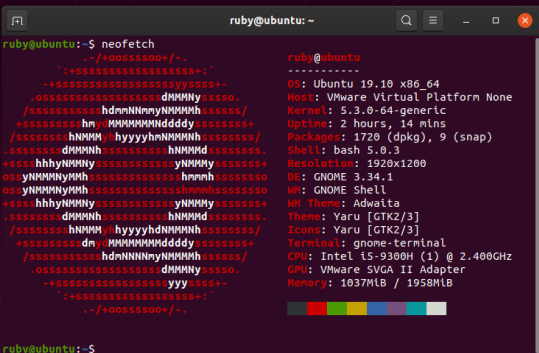

# 第一部分-认识Linux
## Unix的诞生
1.C语言偏向于对内存的操作，更容易经编译成汇编语言输出。
2.Windows和Unix操作系统的不同  
   + Windows主要的应用为图形化操作,而Unix主要为编程语言操作  
   + Unix的思想是自由软件思想,所以Unix是非盈利的开源系统,而Windows是商业软件  
   + Unix没有文件后缀,因此Unix更重视权限,只有获取不同的权限才能打开不同的文件  
   
   
   3.我支持Unix哲学,并且认为以后程序开发的思想会长期从Unix哲学中获益;  
   + Unix哲学认为程序或者操作系统应该尽可能小而轻便
   + Unix哲学可以很好的保证软件运行的流畅性和安全性
## GNU和FOSS
4.BSD许可协议  
5.Linux开源系统    
   Linux许可证是一种可合法执行的软件许可证,成为公共许可证.其主要条款旨在保护使用在Linux平台上创建的开源软件的自由以及使用该软件的个人.Linux许可证最主要的一点是可以被其他用户修改和重新修改,并且没有法律后果,不同于copyright,被称为copyleft.  
6.answer  
   + --Blender    
   + --Gimp    
   + --Inkscape    
   + --Amarok    
   + --VLC  
   + --Openoffice-org  
   + --Mysql  
   + --Gecko  
   + --Gnome  
   + --GNU  
   + --KDE  
   + --Linux  
   + --Nautilus  
   + --Java  
   + --Perl  
   + --PHP  
   + --Python  
   + --Ruby  
   + --Drupal  
   + --Firefox  
   + --Mozzila  
   + --Thunderbird   
 ## The Rise of Linux  
7.Linux是一类操作系统，是拥有Linux内核基于Unix操作系统的总成。  
8.
